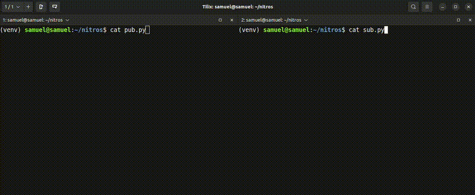

<div align="center">

</div>

# NitROS

Robot communication in 3 lines. Zero config. Just works.

<div align="center">

</div>

---

## The Problem

**Before (ROS2):**
1. Create `.msg` file + edit `CMakeLists.txt` + `package.xml`
2. `colcon build`
3. Wait minutes
4. Fix build errors
5. `source install/setup.bash`
6. Write code

**After (NitROS):**
1. `pip install nitros`. Done.

---

## Installation

```bash
pip install nitros
```

That's it. No CMake, no colcon, no setup scripts.

---

## Get Started

```python
from nitros import Publisher, Subscriber

# Publisher
pub = Publisher("sensors")
pub.send({"temperature": 23.5, "humidity": 65})

# Subscriber
def callback(msg):
    print(msg)

sub = Subscriber("sensors", callback)
```

**That's it!** No configuration, No setup, It just works.

---

## Usage

### Camera Streaming

<div align="center">

</div>

```python
# Publisher
pub = Publisher("camera", compression="image")
pub.send(frame)  # numpy array from cv2

# Subscriber
def show_frame(frame):
    cv2.imshow("Camera", frame)
    cv2.waitKey(1)

Subscriber("camera", show_frame)
```

### Point Cloud

```python
pub = Publisher("lidar", compression="pointcloud")
pub.send(points)  # numpy array, ~5x compression
```

### Options

```python
Publisher("topic", compression="image")       # JPEG compression (~10x)
Publisher("topic", compression="pointcloud")  # quantization + LZ4 (~5x)
Publisher("topic", log=True)                  # enable logging
Subscriber("topic", callback, log=True)       # enable logging
```

### Supported Types

Dicts, lists, numpy arrays, PyTorch tensors (auto-converted to numpy) — auto-detected, auto-serialized.

---

## Why NitROS?

| | |
|---|---|
| **Zero config** | mDNS auto-discovery. No IPs, no ports, no config files. |
| **Send anything** | Dicts, numpy arrays, PyTorch tensors (auto-converted to numpy). |
| **Smart compression** | JPEG for images, LZ4 for point clouds. |
| **Non-blocking** | `send()` never blocks. |
| **Auto-reconnection** | Background threading handles network issues. |

---

## CLI Tools

Already familiar with `ros2 topic`? You already know how to use this.

```bash
nitros topic list
nitros topic echo camera
nitros topic hz camera
nitros topic info camera
```

---

## Limitations

NitROS is **not** a full ROS2 replacement. It focuses on making simple pub/sub communication easy.

**What's missing:**
- Transform system (TF/TF2)
- URDF support
- Action servers
- Service calls
- RQT tools
- Hardware drivers

**Known issues:**
- mDNS can be unreliable on some enterprise networks
- Not stress-tested at large scale
- Limited to basic pub/sub patterns

**Best used for:**
- Quick prototypes
- Simple robot-to-laptop communication
- Competition robots
- Learning robot communication basics

If you need the full ROS2 ecosystem, stick with ROS2. NitROS is for when you just want pub/sub to work.

---

## vs Others

|  | NitROS | ROS2 | ZeroMQ |
|---|---|---|---|
| Setup | `pip install` | Hours | Minutes |
| Config | None | Yes | Yes |
| Type definitions | Auto | Manual `.msg` | Manual |
| Discovery | Auto (mDNS) | DDS config | Manual |
| Compression | Built-in | Manual | Manual |

---

## License

Apache-2.0 License - see [LICENSE](LICENSE)

**Contributing:** Issues and PRs welcome at [github.com/InputNamePlz/NitROS](https://github.com/InputNamePlz/NitROS)
